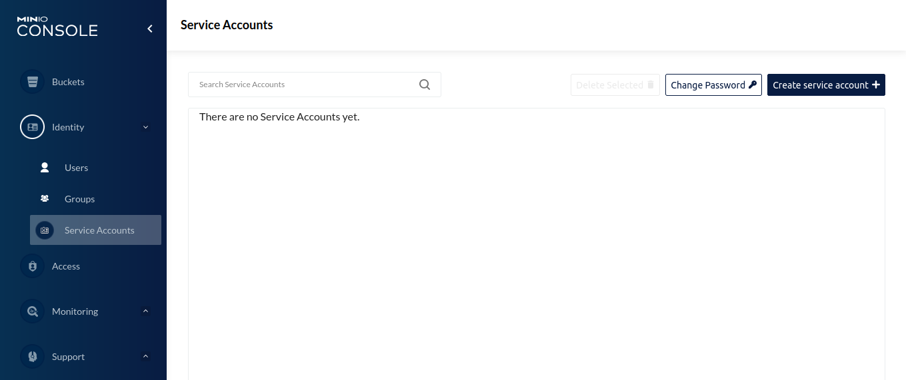
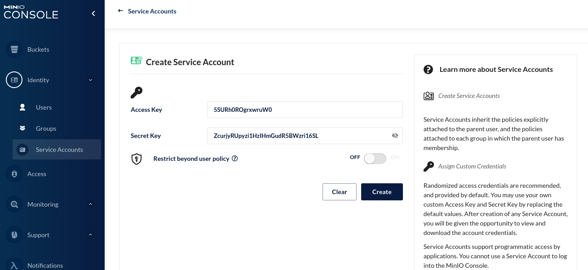
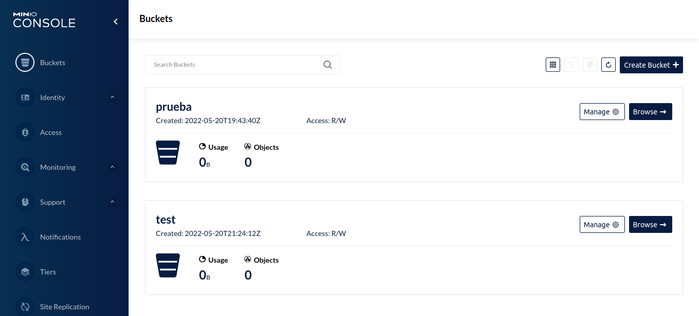
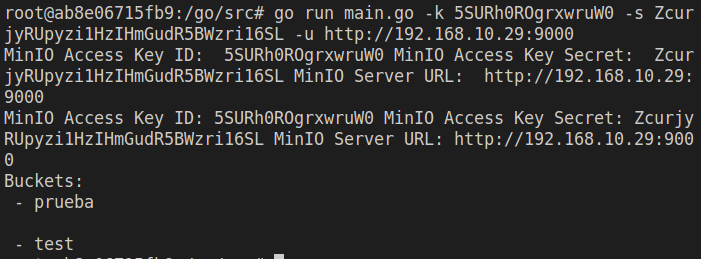

# MinIO como alternativa a Amazon S3 por medio del uso de AWS S3 Api
Es interesante saber que existen en el mercado alternativas tanto de costo como gratis a un producto tan interesante como lo es Amazon S3. En esta descripción se muestra una prueba de esto.

#### **Paso 1**
En este repositorio se encuentra un archivo compose.yml el cual contiene la configuración necesaria para poder desplegar varias instancias de servidores MinIO y una aplicación NginX para poder administrar los mismos. Este archivo debe ejecutarse con el comando
```sh
docker-compose up
```

#### **Paso 2**

En este repositorio se encuentra un archivo Dockerfile, el cual contiene la configuración necesaria para desplegar un contenedor docker con [go](https://go.dev/) configurado y listo para ejecutar la aplicación que se encuentra en el archivo main.go .El archivo debe construirse con el comando
```sh
docker build -t customgo
```
Y posteriormente se ejecuta con:
```sh
docker run --rm -it customgo
```
* **Nota**: Puede también ejecutarse  la aplicación sin necesidad de hacer uso del contenedor, para esto es necesario tener [instalado go](https://go.dev/dl), posteriormente crear un módulo para poder ejecutar la aplicación, el cual puede crearse con 
```sh
go mod init
```
y luego ejecutar 
```sh
go mod tidy
```
para descargar las dependencias (En este caso aws-sdk-go)

#### **Paso 3**
Luego de tener las instancias de los servidores de MinIO ejecutandose y haberles dado un tiempo para que comiencen correctamente, debemos de visitar la página que nos presenta nuestra aplicación de NginX que por defecto se encuentra en [localhost:9001](localhost:9001). Allí es necesario acceder a la pestaña de identidad  y una vez allí crear una nueva cuenta, de la cuál podremos extraer el *access key* y el *secret key*
 Es importante notar que debemos almacenar estos datos en algún lugar puesto que los necesitaremos más adelante.

#### **Paso 4**
Una vez que se tiene hecha la configuración de los diferentes servidores, podemos ya probar la aplicación como tal. Para ello ejecutamos
```sh
go run main.go -k [MINIO_ACCESS_KEY] -s [MINIO_SECRET_KEY] -u http://[IP]:9000
```
donde MINIO_ACCESS_KEY y MINIO_SECRET_KEY son las credenciales que recuperamos anteriormente y IP resulta siendo la dirección IP de donde se está ejecutando el servidor.
En un primer momento, la salida no mostrará Buckets puesto que claramente no hay.

#### **Paso 5**
Para comprobar que la configuración que acabamos de hacer está funcionando correctamente, podemos crear otros 'buckets' y posteriormente listar los mismos y veremos el cambio, para ello vamos a la pestaña 'buckets' y allí creamos un par nuevos:

Entonces si volvemos a ejecutar el programa, tendremos que:
